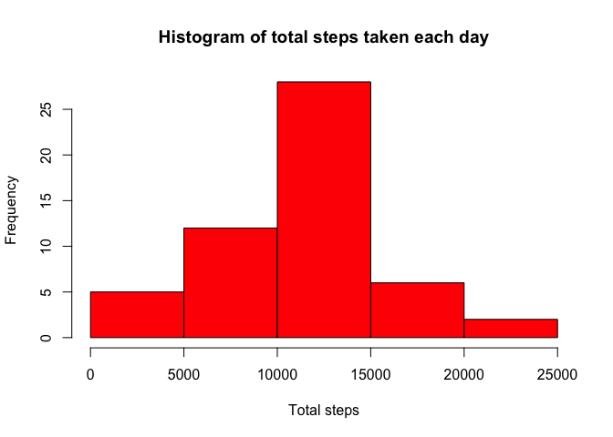
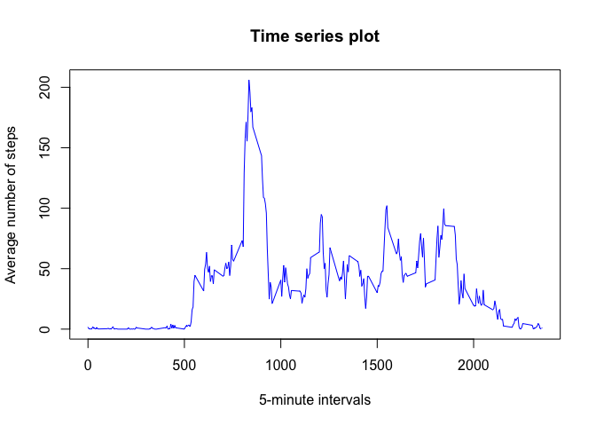
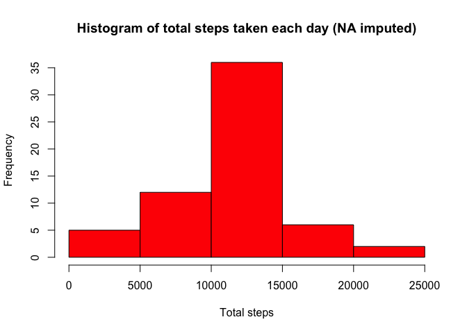

# Reproducible Research: Peer Assessment 1


## Loading and preprocessing the data

In a first step we need to load the data. The data is available as a .csv file after unzipping the compressed file. It contains three variables: steps, date, interval. We set the colClasses of the read.csv() command to reflect the different variable types. We also convert the date from character to R's date class.

```r
activity<-read.csv("activity.csv",colClasses=c("numeric","character","numeric"))
activity$date<-as.Date(activity$date)
```

## What is mean total number of steps taken per day?
Here we use the ```aggregate()``` function to sum up the steps taken per day. With these total steps we can plot the histogramm and calculate the steps statistics. 

```r
stepsaday<-aggregate(steps ~ date,activity,sum)
hist(stepsaday$steps,col="red",xlab="Total steps",main="Histogram of total steps taken each day")
```

 

```r
mean(stepsaday$steps)
```

```
## [1] 10766.19
```

```r
median(stepsaday$steps)
```

```
## [1] 10765
```

## What is the average daily activity pattern?
As before, we use the ```aggregate()``` function to calculate the mean (average) across all days of the number of steps taken.

```r
stepsininterval<-aggregate(steps~interval,activity,mean)
plot(stepsininterval$interval,stepsininterval$steps,type="l",col="blue",main="Time series plot",ylab="Average number of steps", xlab="5-minute intervals")
```

 

```r
##  Get the interval with the maximum number of average steps
stepsininterval$interval[which.max(stepsininterval$steps)]
```

```
## [1] 835
```

## Imputing missing values
First we need to calculate the total number of missing values in the dataset. It is interesting to find the NA within each column.

```r
apply(is.na(activity),2,sum)
```

```
##    steps     date interval 
##     2304        0        0
```
We see that only the variable steps contains 2304 NA values. 

Now we need a strategy for filling in all of the missing values in the dataset. We use the mean steps count for each intervall. This is already calculated above and we can use this result to assign the values to the NA.

```r
##  Replicate the dataset as a new copy
activityimpute<-activity

##  Find all rowids where steps is NA 
naids<-which(is.na(activityimpute$steps))

##  Get the intervals in these rows 
naintervals<-activityimpute$interval[naids]

##  Assign the mean steps for each interval
meansteps<-lapply(naintervals,function (x) {stepsininterval$steps[stepsininterval$interval == x]})
meansteps<-unlist(meansteps)

##  Finally assign the meansteps to the NAs
activityimpute$steps[naids]<-meansteps

##  Now do the plotting and the statistics
stepsaday<-aggregate(steps ~ date,activityimpute,sum)
hist(stepsaday$steps,col="red",xlab="Total steps",main="Histogram of total steps taken each day (NA imputed)")
```

 

```r
mean(stepsaday$steps)
```

```
## [1] 10766.19
```

```r
median(stepsaday$steps)
```

```
## [1] 10766.19
```


## Are there differences in activity patterns between weekdays and weekends?

```r
##  Loop over each date and assign weekday or weekend to it
daylist<-lapply(activityimpute$date,function(x) {if (weekdays(x) %in% c("Samstag","Sonntag")) {return("weekend")} else return("weekday")})
daylist<-unlist(daylist)

##  Create a new factor variable
a<-cbind(activityimpute,daytype=as.factor(daylist))
##  Average over the intervals and day types
b<-aggregate(steps~interval+daytype,a,mean)

##  Plot using the lattice system
library(lattice)
xyplot(steps~interval|daytype,b,type="l",layout=c(1,2))
```

 

